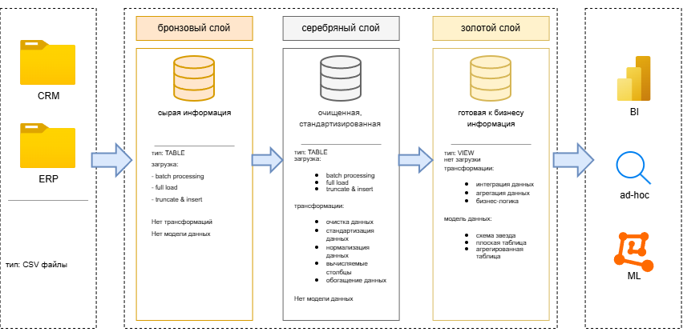

# SQL-DWH-project
  Архитектура данных для этого проекта основана на Медальонной архитектуре (Medallion Architecture) и состоит из слоев Bronze (Бронзовый), Silver (Серебряный) и Gold (Золотой):


  
  1. Слой Bronze (Бронзовый): Содержит необработанные (сырые) данные в том виде, в котором они поступают из исходных систем. Данные загружаются из CSV-файлов в базу данных SQL Server.
  
  2. Слой Silver (Серебряный): На этом слое выполняются процессы очистки, стандартизации и нормализации данных для их подготовки к анализу.
  
  3. Слой Gold (Золотой): Содержит готовые для бизнеса данные, смоделированные в виде схемы «звезда», которая необходима для отчетности и аналитики.
  
  📖 Обзор проекта
  
  Этот проект включает в себя:
  
  - Архитектуру данных: Проектирование современного хранилища данных (Modern Data Warehouse) с использованием Бронзового, Серебряного и Золотого слоев Медальонной архитектуры.
  
  - ETL-конвейеры: Извлечение, преобразование и загрузку данных (ETL) из исходных систем в хранилище.
  
  - Моделирование данных: Разработку таблиц фактов и измерений, оптимизированных для аналитических запросов.
  
  - Аналитику и отчетность: Создание отчетов и дашбордов на базе SQL для получения полезных для бизнеса инсайтов.

## 📂 Структура проекта

```text
data-warehouse-project/
│
├── datasets/                           # Исходные наборы данных (данные ERP и CRM)
│
├── docs/                               # Документация проекта и архитектурные схемы
│   ├── data_architecture.png           # Схема общей архитектуры проекта
│   ├── data_catalog.md                 # Каталог данных (описание полей и метаданные)
│   ├── data_flow.png                   # Диаграмма потоков данных (Data Flow)
│   ├── data_model.ong                  # Модель данных (схема «Звезда» / Star Schema)
│   ├── naming-conventions.md           # Руководство по соглашению о наименованиях таблиц и колонок
│
├── scripts/                            # SQL-скрипты для ETL и трансформации данных
│   ├── bronze/                         # Бронзовый слой: загрузка и экстракция сырых данных
│   ├── silver/                         # Серебряный слой: очистка, проверка качества и типизация
│   ├── gold/                           # Золотой слой: построение аналитических витрин и KPI
│
├── tests/                              # Скрипты тестирования и проверки качества данных
│
├── README.md                           # Описание проекта и инструкции по запуску
├── LICENSE                             # Информация о лицензии репозитория
```
